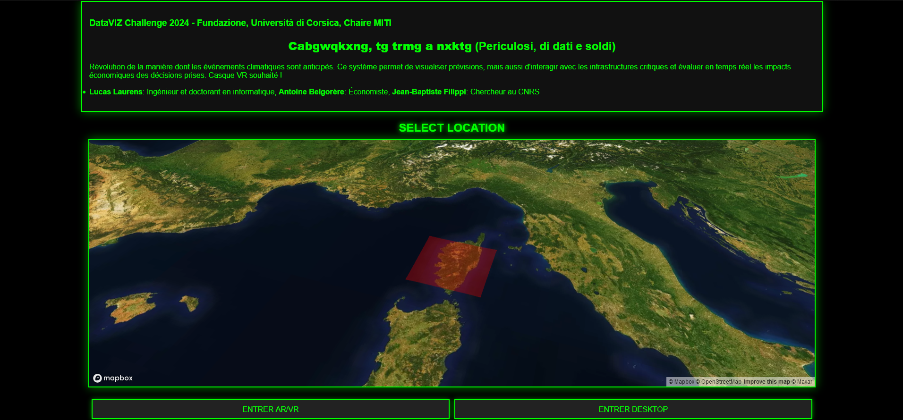
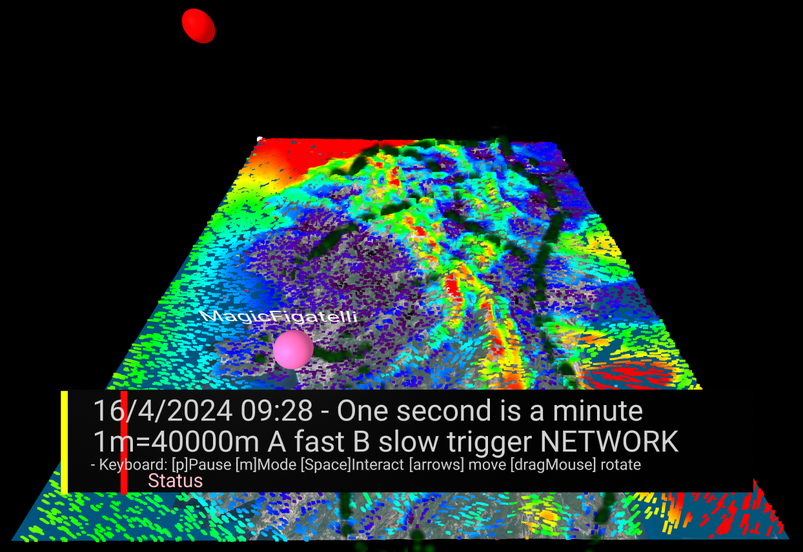
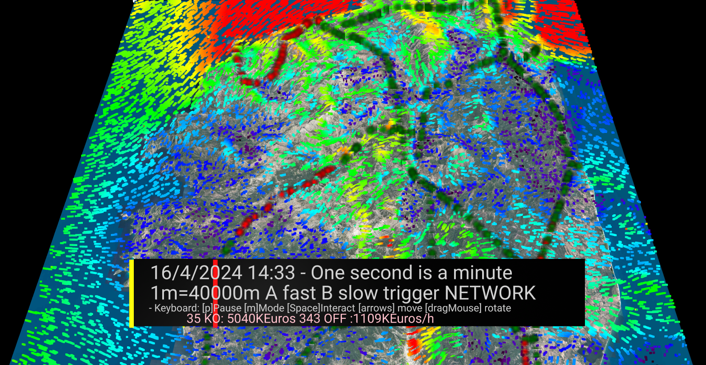

# Projet : "Periculosi, di dati e soldi"

**Nom de l'équipe :** "Cabgwqkxng, tg trmg a nxktg" (Corse transcrit en Orcish)

**Traduction :** "Periculosi, di dati e soldi" (Dangereux, données et argent)

## Résumé du projet

Cette application permet de visualiser à la fois des données météorologiques et des données d'un réseau électrique, afin de simuler des dégâts sur le réseau et obtenir une prévision du coût de ces dégâts.

## Démonstration

Une vidéo de démonstration est disponible ci dessous :

## Utilisation

### En ligne

L'application est disponible sur le site de [Forefire](https://forefire.univ-corse.fr/dati-e-soldi/) et sur [GitHub Pages](https://filippi.github.io/dati-e-soldi/).

### En local

Il est également possible de cloner le dépôt et d'utiliser un serveur local pour ouvrir le fichier **index.html** dans un navigateur.

La localisation de la visualisation peut être choisie ici ; par défaut, les données couvrent uniquement la Corse.

Après avoir détruit des pylônes, la partie du réseau qui n'est plus connectée à une source d'énergie s'affiche en rouge, et une estimation du coût est disponible.

## Capacités de l'outil

- **Visualisation de la météo** : 48 heures de prévisions du vent sont disponibles par défaut et visibles selon l'échelle de temps souhaitée : en pause, temps réel, par minute, par heure, et même en sens inverse.

- **Multiplateformes** : La visualisation est concue pour la réalité virtuelle et augmentée, mais est également disponible dans un mode "ordinateur".

- **Collaboration en temps réel** : toutes les personnes qui sont connectées à l'outil sont présentes et visibles dans un même environnement, peu importe la plateforme utilisée.

- **Interactions diverses** : 3 simulations sont disponibles : en mode **fumée** et **pluie**, interagir avec la carte créée une particule, qui va être influencée par le vent et le terrain. En mode **réseau**, cliquer sur un pylône électrique simule sa destruction, et permet de visualiser les zones du réseau impactées.

- **Estimation des coûts** : L'impact sur le réseau est chiffré selon le coût de remplacement des pylônes détruits et le coût d'indemnisation des logements touchés par heure de coupure.

## Données utilisées

- Données météo Arome
- Données satellites et topologiques de la Corse
- Lignes hautes tension et postes sources d'[EDF Corse](https://opendata-corse.edf.fr)
- Sites de production d'électricité d'[OpenStreetMap](https://www.openstreetmap.org)

## Technologies utilisées

- **VR / AR** : [A-Frame](https://aframe.io)

- **Visualisation du réseau** : [Leaflet](https://leafletjs.com)

- **Gestion du réseau** : [Cytoscape.js](https://js.cytoscape.org)

- **Préprocessing des données du réseau électrique** :
 	- **API OpenStreetMap** : overpass
 	- **Traitement des données** : pandas, numpy, geopy, pygeohash, regex, sklearn

## Membres de l'équipe

- **Lucas Laurens** : Ingénieur et doctorant en informatique

- **Jean-Baptiste Filippi** : Chercheur en informatique
  
## Fichiers

- **pre_processing/reseau_edf.py** : Génère le réseau électrique sous format json à partir des données de l'Opendata EDF Corse

- **network_leaflet.html** : Visualisation et interaction avec le réseau en 2D, avec la librairie Leaflet

- **network.html** : Permet de tester **network.js** et ses fonctions *getAllNodesWithTypes()*, *reinit()*, *clickEvent(lat, lon)* et *printCost()*
